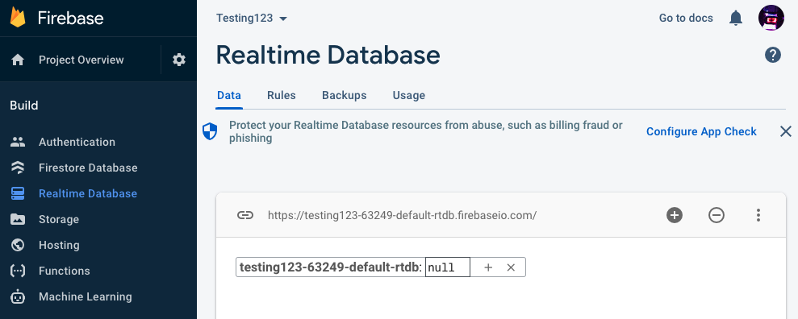
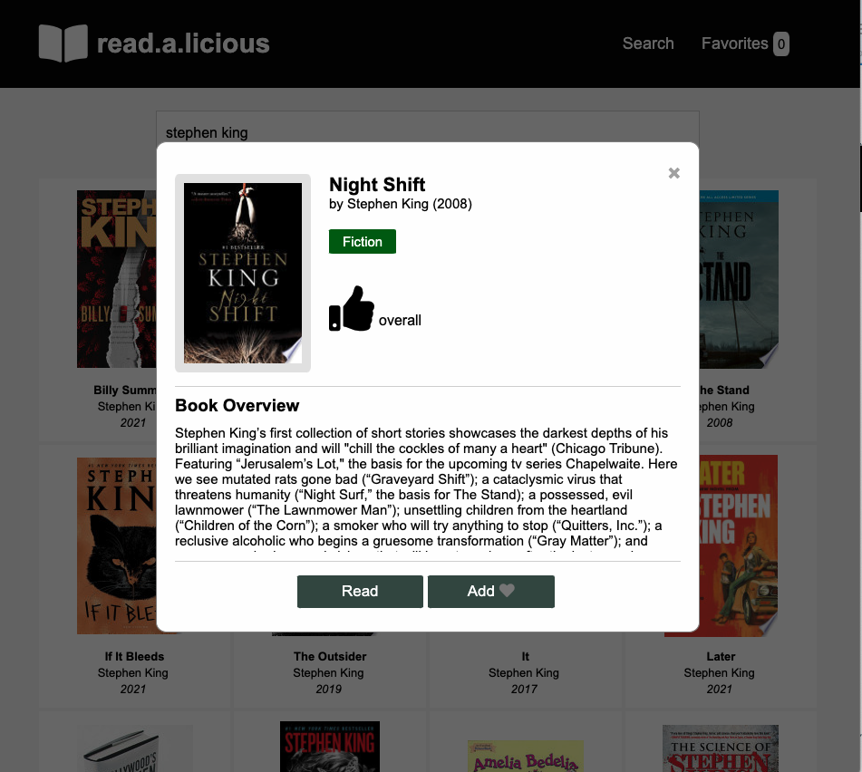
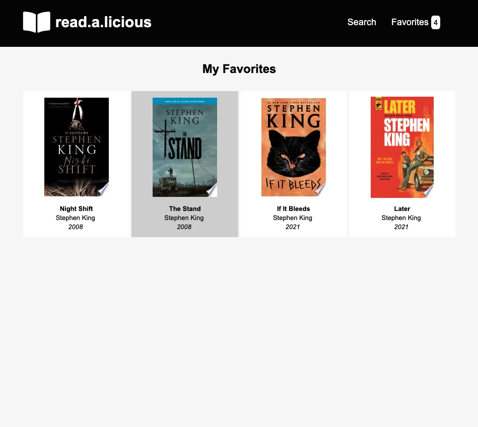
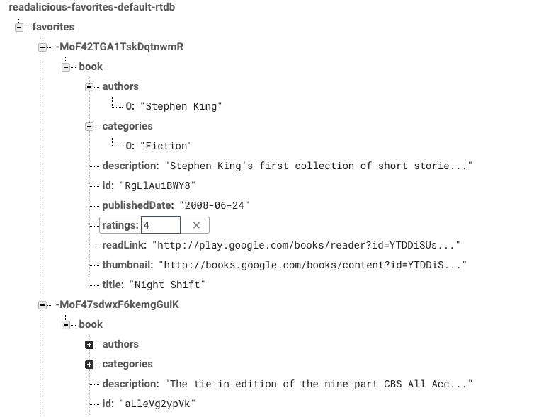

# React Context and external storage with Readalicious

In this project, you will utilize React Context and Firebase to persist choosen favorites from the Readalicious application.

## Project Setup

Before beginning this project you will need your Google Books API key (from previous project) and also a Firebase project connected to a "Realtime Database". Be sure to replace the Google Books API key in the codebase with your key.

Follow the steps below to set up your Firebase account.

1. Go to https://firebase.google.com/ and log in with your Google account.
2. Click "Go to console" in the right-hand side of the nav bar.
3. Click add/create a project.
4. Enter your project name and continue.
5. Disable Google Analytics and continue.
6. After project is ready, continue.
7. In the left-hand nav bar, select "Realtime Database".
8. Choose "Create Database".
9. Choose default location (us-central1) and continue.
10. Choose "Start in test mode" and enable.

After completing these steps, you should see something similar to below. Take note of the URL at the top of the database console. This will be the URL you use to make requests to Firebase.


## Instructions

Modify the codebase in this repository to implement "favorite books" functionality within Readalicious. You will utilize the React Context API to make favorite books available to other parts of the application and in addition you will store the favorites externally via the Firebase API.

All code and styles are complete except for the FavoritesContext and FavoritesProvider located in _src/store/favorites-context.js_. Once you have completed this code, the application should function as expected. No other modification should be required in any other files.

The finished project should offer the following functionality:

1. Add a favorite book from book modal window.
   

2. Remove a favorite book from the modal window.
   

3. List count of books favorited next to the "Favorites" navigation menu item.
4. List favorited books within the "Favorites" section of the application.
   

## Technical Notes

On application load, the FavoritesProvider should load all current favorites from the Firebase API and when a favorite is added or removed, the application should make an HTTP request to add/remove the favorite from the Firebase API.Please check the comments in _src/store/favorites-context.js_ for technical considerations and implementation advice.

Of special note is the data structure required for this implementation. When reading books from the Google Books API, the application stores the book in state with the following structure ...

```javascript
{
    id: 'RgksdkjAB8',
    authors: ['Stephen King'],
    categories: ['Fiction'],
    publishedDate: '2008-06-24',
    ratings: 4,
    readLink: 'https://some-link.com',
    thumbnail: 'https://some-link.com',
    title: 'Night Shift'
}
```

A favorite stored in state should have the following data structure ...

```javascript
{
    id: 'Mkjsdkfjdsldsf',
    book: {
        id: 'RgksdkjAB8',
        authors: ['Stephen King'],
        categories: ['Fiction'],
        publishedDate: '2008-06-24',
        ratings: 4,
        readLink: 'https://some-link.com',
        thumbnail: 'https://some-link.com',
        title: 'Night Shift'
    }
}
```

The top-level id is that returned from the Firebase post response.

In Firebase, stored favorites should look as follows ...


## Project Submission

When finished with your assignment, be sure to commit all your code and push to the remote GitHub repository.
